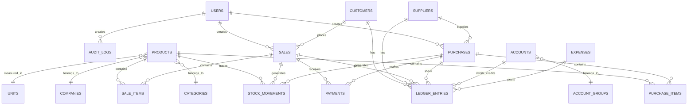

# ZYNC-ERP Database Schema

## Entity Relationship Overview



## Table Specifications

### 1. Master Tables

#### users
| Column | Type | Constraints | Description |
|--------|------|-------------|-------------|
| id | UUID | PK | Primary key |
| username | VARCHAR(50) | UNIQUE, NOT NULL | Login username |
| password_hash | VARCHAR(255) | NOT NULL | Bcrypt hashed password |
| full_name | VARCHAR(100) | NOT NULL | Display name |
| email | VARCHAR(100) | UNIQUE | Email address |
| phone | VARCHAR(20) | | Contact number |
| role | ENUM | NOT NULL | admin, manager, cashier, viewer |
| is_active | BOOLEAN | DEFAULT true | Soft disable |
| last_login | TIMESTAMP | | Last login time |
| created_at | TIMESTAMP | DEFAULT NOW() | |
| updated_at | TIMESTAMP | | |

#### products
| Column | Type | Constraints | Description |
|--------|------|-------------|-------------|
| id | UUID | PK | Primary key |
| code | VARCHAR(50) | UNIQUE, NOT NULL | Product code/SKU |
| barcode | VARCHAR(50) | UNIQUE | Barcode number |
| name | VARCHAR(200) | NOT NULL | Product name |
| description | TEXT | | Detailed description |
| category_id | UUID | FK → categories | Category reference |
| company_id | UUID | FK → companies | Brand/Company reference |
| unit_id | UUID | FK → units | Unit of measure |
| retail_price | DECIMAL(15,2) | NOT NULL | Retail selling price |
| wholesale_price | DECIMAL(15,2) | | Wholesale price |
| cost_price | DECIMAL(15,2) | | Last purchase cost |
| min_stock_level | DECIMAL(15,3) | DEFAULT 0 | Reorder alert level |
| track_stock | BOOLEAN | DEFAULT true | Enable stock tracking |
| image_path | VARCHAR(500) | | Product image path |
| is_active | BOOLEAN | DEFAULT true | Soft delete flag |
| created_at | TIMESTAMP | DEFAULT NOW() | |
| updated_at | TIMESTAMP | | |

#### categories
| Column | Type | Constraints | Description |
|--------|------|-------------|-------------|
| id | UUID | PK | Primary key |
| name | VARCHAR(100) | UNIQUE, NOT NULL | Category name |
| description | TEXT | | Category description |
| parent_id | UUID | FK → categories | Parent for hierarchy |
| is_active | BOOLEAN | DEFAULT true | |
| created_at | TIMESTAMP | DEFAULT NOW() | |

#### companies
| Column | Type | Constraints | Description |
|--------|------|-------------|-------------|
| id | UUID | PK | Primary key |
| name | VARCHAR(100) | UNIQUE, NOT NULL | Brand/Company name |
| description | TEXT | | |
| is_active | BOOLEAN | DEFAULT true | |
| created_at | TIMESTAMP | DEFAULT NOW() | |

#### units
| Column | Type | Constraints | Description |
|--------|------|-------------|-------------|
| id | UUID | PK | Primary key |
| name | VARCHAR(50) | UNIQUE, NOT NULL | e.g., Piece, Kg, Box |
| abbreviation | VARCHAR(10) | NOT NULL | e.g., pcs, kg, box |
| is_active | BOOLEAN | DEFAULT true | |

#### customers
| Column | Type | Constraints | Description |
|--------|------|-------------|-------------|
| id | UUID | PK | Primary key |
| code | VARCHAR(20) | UNIQUE | Customer code |
| name | VARCHAR(200) | NOT NULL | Customer name |
| phone | VARCHAR(20) | INDEX | Primary phone (searchable) |
| phone_alt | VARCHAR(20) | | Alternate phone |
| email | VARCHAR(100) | | Email address |
| address | TEXT | | Full address |
| city | VARCHAR(100) | | City |
| cnic | VARCHAR(15) | | National ID (Pakistan) |
| credit_limit | DECIMAL(15,2) | DEFAULT 0 | Maximum credit allowed |
| opening_balance | DECIMAL(15,2) | DEFAULT 0 | Starting balance |
| account_id | UUID | FK → accounts | Linked ledger account |
| is_active | BOOLEAN | DEFAULT true | |
| created_at | TIMESTAMP | DEFAULT NOW() | |
| updated_at | TIMESTAMP | | |

#### suppliers
| Column | Type | Constraints | Description |
|--------|------|-------------|-------------|
| id | UUID | PK | Primary key |
| code | VARCHAR(20) | UNIQUE | Supplier code |
| name | VARCHAR(200) | NOT NULL | Supplier name |
| phone | VARCHAR(20) | | Primary phone |
| email | VARCHAR(100) | | Email address |
| address | TEXT | | Full address |
| city | VARCHAR(100) | | City |
| contact_person | VARCHAR(100) | | Contact name |
| opening_balance | DECIMAL(15,2) | DEFAULT 0 | Starting balance |
| account_id | UUID | FK → accounts | Linked ledger account |
| is_active | BOOLEAN | DEFAULT true | |
| created_at | TIMESTAMP | DEFAULT NOW() | |
| updated_at | TIMESTAMP | | |

### 2. Transaction Tables

#### sales
| Column | Type | Constraints | Description |
|--------|------|-------------|-------------|
| id | UUID | PK | Primary key |
| invoice_number | VARCHAR(30) | UNIQUE, NOT NULL | Auto-generated invoice # |
| invoice_date | DATE | NOT NULL | Invoice date |
| customer_id | UUID | FK → customers | Customer reference |
| subtotal | DECIMAL(15,2) | NOT NULL | Before discount |
| discount_amount | DECIMAL(15,2) | DEFAULT 0 | Total discount |
| tax_amount | DECIMAL(15,2) | DEFAULT 0 | Total tax |
| total_amount | DECIMAL(15,2) | NOT NULL | Final total |
| paid_amount | DECIMAL(15,2) | DEFAULT 0 | Amount paid |
| balance_amount | DECIMAL(15,2) | COMPUTED | Remaining balance |
| payment_status | ENUM | NOT NULL | paid, partial, unpaid |
| status | ENUM | DEFAULT 'completed' | completed, cancelled, returned |
| notes | TEXT | | Invoice notes |
| created_by | UUID | FK → users | Cashier/creator |
| created_at | TIMESTAMP | DEFAULT NOW() | |
| updated_at | TIMESTAMP | | |

#### sale_items
| Column | Type | Constraints | Description |
|--------|------|-------------|-------------|
| id | UUID | PK | Primary key |
| sale_id | UUID | FK → sales, NOT NULL | Parent sale |
| product_id | UUID | FK → products, NOT NULL | Product sold |
| quantity | DECIMAL(15,3) | NOT NULL | Qty sold |
| unit_price | DECIMAL(15,2) | NOT NULL | Price at sale time |
| cost_price | DECIMAL(15,2) | NOT NULL | Cost at sale time (FIFO) |
| discount_percent | DECIMAL(5,2) | DEFAULT 0 | Line discount % |
| discount_amount | DECIMAL(15,2) | DEFAULT 0 | Line discount amount |
| tax_percent | DECIMAL(5,2) | DEFAULT 0 | Tax rate |
| tax_amount | DECIMAL(15,2) | DEFAULT 0 | Line tax |
| line_total | DECIMAL(15,2) | NOT NULL | Final line amount |
| created_at | TIMESTAMP | DEFAULT NOW() | |

#### purchases
| Column | Type | Constraints | Description |
|--------|------|-------------|-------------|
| id | UUID | PK | Primary key |
| bill_number | VARCHAR(30) | UNIQUE, NOT NULL | Purchase bill # |
| bill_date | DATE | NOT NULL | Bill date |
| supplier_id | UUID | FK → suppliers | Supplier reference |
| reference_number | VARCHAR(50) | | Supplier's invoice # |
| subtotal | DECIMAL(15,2) | NOT NULL | Before discount |
| discount_amount | DECIMAL(15,2) | DEFAULT 0 | |
| tax_amount | DECIMAL(15,2) | DEFAULT 0 | |
| total_amount | DECIMAL(15,2) | NOT NULL | |
| paid_amount | DECIMAL(15,2) | DEFAULT 0 | |
| balance_amount | DECIMAL(15,2) | COMPUTED | |
| payment_status | ENUM | NOT NULL | paid, partial, unpaid |
| status | ENUM | DEFAULT 'completed' | completed, cancelled |
| notes | TEXT | | |
| created_by | UUID | FK → users | |
| created_at | TIMESTAMP | DEFAULT NOW() | |
| updated_at | TIMESTAMP | | |

#### purchase_items
| Column | Type | Constraints | Description |
|--------|------|-------------|-------------|
| id | UUID | PK | Primary key |
| purchase_id | UUID | FK → purchases, NOT NULL | Parent purchase |
| product_id | UUID | FK → products, NOT NULL | Product purchased |
| quantity | DECIMAL(15,3) | NOT NULL | Qty purchased |
| unit_cost | DECIMAL(15,2) | NOT NULL | Cost per unit |
| discount_percent | DECIMAL(5,2) | DEFAULT 0 | |
| discount_amount | DECIMAL(15,2) | DEFAULT 0 | |
| tax_percent | DECIMAL(5,2) | DEFAULT 0 | |
| tax_amount | DECIMAL(15,2) | DEFAULT 0 | |
| line_total | DECIMAL(15,2) | NOT NULL | |
| created_at | TIMESTAMP | DEFAULT NOW() | |

#### stock_movements
| Column | Type | Constraints | Description |
|--------|------|-------------|-------------|
| id | UUID | PK | Primary key |
| product_id | UUID | FK → products, NOT NULL | Product reference |
| movement_type | ENUM | NOT NULL | IN, OUT, ADJUSTMENT |
| reference_type | ENUM | NOT NULL | sale, purchase, adjustment, opening, return |
| reference_id | UUID | | Related document ID |
| quantity | DECIMAL(15,3) | NOT NULL | +ve for IN, -ve for OUT |
| unit_cost | DECIMAL(15,2) | NOT NULL | Cost at time of movement |
| remaining_qty | DECIMAL(15,3) | | For FIFO tracking |
| notes | TEXT | | Reason for adjustment |
| created_by | UUID | FK → users | |
| created_at | TIMESTAMP | DEFAULT NOW() | |

> **FIFO Logic**: For sales (OUT), we consume from oldest stock_movements (IN) where remaining_qty > 0

#### payments
| Column | Type | Constraints | Description |
|--------|------|-------------|-------------|
| id | UUID | PK | Primary key |
| payment_type | ENUM | NOT NULL | receipt, payment |
| payment_method | ENUM | NOT NULL | cash, bank, cheque |
| reference_type | ENUM | NOT NULL | sale, purchase, customer, supplier |
| reference_id | UUID | NOT NULL | Related document |
| amount | DECIMAL(15,2) | NOT NULL | Payment amount |
| payment_date | DATE | NOT NULL | |
| bank_account_id | UUID | FK → accounts | If bank payment |
| cheque_number | VARCHAR(50) | | If cheque |
| notes | TEXT | | |
| created_by | UUID | FK → users | |
| created_at | TIMESTAMP | DEFAULT NOW() | |

### 3. Accounting Tables

#### account_groups
| Column | Type | Constraints | Description |
|--------|------|-------------|-------------|
| id | UUID | PK | Primary key |
| name | VARCHAR(100) | NOT NULL | Group name |
| type | ENUM | NOT NULL | asset, liability, income, expense, capital |
| parent_id | UUID | FK → account_groups | Hierarchy |
| sequence | INTEGER | | Display order |
| is_system | BOOLEAN | DEFAULT false | System-created |

#### accounts
| Column | Type | Constraints | Description |
|--------|------|-------------|-------------|
| id | UUID | PK | Primary key |
| code | VARCHAR(20) | UNIQUE, NOT NULL | Account code |
| name | VARCHAR(100) | NOT NULL | Account name |
| group_id | UUID | FK → account_groups, NOT NULL | Parent group |
| account_type | ENUM | NOT NULL | asset, liability, income, expense, capital |
| is_bank_account | BOOLEAN | DEFAULT false | |
| bank_name | VARCHAR(100) | | If bank account |
| account_number | VARCHAR(50) | | Bank account # |
| opening_balance | DECIMAL(15,2) | DEFAULT 0 | |
| current_balance | DECIMAL(15,2) | DEFAULT 0 | Cached balance |
| is_system | BOOLEAN | DEFAULT false | System-created |
| is_active | BOOLEAN | DEFAULT true | |
| created_at | TIMESTAMP | DEFAULT NOW() | |

#### ledger_entries
| Column | Type | Constraints | Description |
|--------|------|-------------|-------------|
| id | UUID | PK | Primary key |
| entry_date | DATE | NOT NULL | Transaction date |
| account_id | UUID | FK → accounts, NOT NULL | Account affected |
| entry_type | ENUM | NOT NULL | debit, credit |
| amount | DECIMAL(15,2) | NOT NULL | Entry amount |
| reference_type | ENUM | NOT NULL | sale, purchase, payment, expense, journal, opening |
| reference_id | UUID | | Related document |
| narration | TEXT | | Description |
| journal_id | UUID | FK → journals | Parent journal |
| created_by | UUID | FK → users | |
| created_at | TIMESTAMP | DEFAULT NOW() | |

> **Double-Entry Rule**: Every journal must have SUM(debits) = SUM(credits)

#### journals
| Column | Type | Constraints | Description |
|--------|------|-------------|-------------|
| id | UUID | PK | Primary key |
| journal_number | VARCHAR(30) | UNIQUE | Auto-generated |
| journal_date | DATE | NOT NULL | |
| journal_type | ENUM | NOT NULL | sales, purchase, receipt, payment, expense, general |
| narration | TEXT | | |
| is_posted | BOOLEAN | DEFAULT true | |
| created_by | UUID | FK → users | |
| created_at | TIMESTAMP | DEFAULT NOW() | |

### 4. Expense Tables

#### expense_categories
| Column | Type | Constraints | Description |
|--------|------|-------------|-------------|
| id | UUID | PK | Primary key |
| name | VARCHAR(100) | UNIQUE, NOT NULL | e.g., Rent, Utilities |
| account_id | UUID | FK → accounts | Linked expense account |
| is_active | BOOLEAN | DEFAULT true | |

#### expenses
| Column | Type | Constraints | Description |
|--------|------|-------------|-------------|
| id | UUID | PK | Primary key |
| expense_number | VARCHAR(30) | UNIQUE | |
| expense_date | DATE | NOT NULL | |
| category_id | UUID | FK → expense_categories | |
| amount | DECIMAL(15,2) | NOT NULL | |
| payment_method | ENUM | NOT NULL | cash, bank |
| bank_account_id | UUID | FK → accounts | If bank |
| description | TEXT | | |
| created_by | UUID | FK → users | |
| created_at | TIMESTAMP | DEFAULT NOW() | |

### 5. Logistics Tables

#### quotations
| Column | Type | Constraints | Description |
|--------|------|-------------|-------------|
| id | UUID | PK | Primary key |
| quotation_number | VARCHAR(30) | UNIQUE | |
| quotation_date | DATE | NOT NULL | |
| customer_id | UUID | FK → customers | |
| valid_until | DATE | | |
| total_amount | DECIMAL(15,2) | | |
| status | ENUM | DEFAULT 'draft' | draft, sent, converted, expired |
| converted_to_sale_id | UUID | FK → sales | If converted |
| notes | TEXT | | |
| created_by | UUID | FK → users | |
| created_at | TIMESTAMP | DEFAULT NOW() | |

#### delivery_challans
| Column | Type | Constraints | Description |
|--------|------|-------------|-------------|
| id | UUID | PK | Primary key |
| challan_number | VARCHAR(30) | UNIQUE | |
| challan_date | DATE | NOT NULL | |
| sale_id | UUID | FK → sales | Related invoice |
| customer_id | UUID | FK → customers | |
| delivery_address | TEXT | | |
| status | ENUM | DEFAULT 'pending' | pending, delivered |
| delivered_at | TIMESTAMP | | |
| notes | TEXT | | |
| created_by | UUID | FK → users | |
| created_at | TIMESTAMP | DEFAULT NOW() | |

#### gate_passes
| Column | Type | Constraints | Description |
|--------|------|-------------|-------------|
| id | UUID | PK | Primary key |
| pass_number | VARCHAR(30) | UNIQUE | |
| pass_date | DATE | NOT NULL | |
| pass_type | ENUM | NOT NULL | inward, outward |
| reference_type | ENUM | | sale, purchase, transfer |
| reference_id | UUID | | |
| description | TEXT | | |
| vehicle_number | VARCHAR(20) | | |
| driver_name | VARCHAR(100) | | |
| created_by | UUID | FK → users | |
| created_at | TIMESTAMP | DEFAULT NOW() | |

### 6. Support Tables

#### sequences
| Column | Type | Constraints | Description |
|--------|------|-------------|-------------|
| id | UUID | PK | Primary key |
| name | VARCHAR(50) | UNIQUE, NOT NULL | e.g., invoice, purchase |
| prefix | VARCHAR(10) | | e.g., INV-, PUR- |
| current_value | BIGINT | DEFAULT 0 | Current counter |
| pad_length | INTEGER | DEFAULT 6 | Zero padding |
| reset_yearly | BOOLEAN | DEFAULT false | Reset on new year |
| last_reset | DATE | | Last reset date |

#### settings
| Column | Type | Constraints | Description |
|--------|------|-------------|-------------|
| id | UUID | PK | Primary key |
| key | VARCHAR(100) | UNIQUE, NOT NULL | Setting key |
| value | TEXT | | Setting value |
| type | ENUM | DEFAULT 'string' | string, number, boolean, json |
| description | TEXT | | |
| updated_at | TIMESTAMP | | |

#### audit_logs
| Column | Type | Constraints | Description |
|--------|------|-------------|-------------|
| id | UUID | PK | Primary key |
| user_id | UUID | FK → users | User who made change |
| action | ENUM | NOT NULL | create, update, delete |
| table_name | VARCHAR(50) | NOT NULL | Affected table |
| record_id | UUID | NOT NULL | Affected record |
| old_values | JSONB | | Previous values |
| new_values | JSONB | | New values |
| ip_address | VARCHAR(45) | | Client IP |
| created_at | TIMESTAMP | DEFAULT NOW() | |

## Indexes

### Critical Performance Indexes

```sql
-- Customer phone lookup (Khata search)
CREATE INDEX idx_customers_phone ON customers(phone);
CREATE INDEX idx_customers_name ON customers(name);

-- Product search
CREATE INDEX idx_products_name ON products(name);
CREATE INDEX idx_products_barcode ON products(barcode);
CREATE INDEX idx_products_code ON products(code);

-- Sales by date
CREATE INDEX idx_sales_date ON sales(invoice_date);
CREATE INDEX idx_sales_customer ON sales(customer_id);

-- Stock movements for FIFO
CREATE INDEX idx_stock_movements_product ON stock_movements(product_id, created_at);
CREATE INDEX idx_stock_movements_remaining ON stock_movements(product_id, remaining_qty) 
    WHERE remaining_qty > 0;

-- Ledger queries
CREATE INDEX idx_ledger_account_date ON ledger_entries(account_id, entry_date);
CREATE INDEX idx_ledger_reference ON ledger_entries(reference_type, reference_id);
```

## Default System Accounts

The system will create these accounts on first run:

| Code | Name | Type | Group |
|------|------|------|-------|
| 1000 | Cash | Asset | Current Assets |
| 1100 | Bank Account | Asset | Current Assets |
| 1200 | Accounts Receivable | Asset | Current Assets |
| 1300 | Inventory | Asset | Current Assets |
| 2000 | Accounts Payable | Liability | Current Liabilities |
| 3000 | Capital | Capital | Capital |
| 4000 | Sales Revenue | Income | Sales |
| 4100 | Sales Discounts | Income | Sales |
| 5000 | Cost of Goods Sold | Expense | Cost of Sales |
| 5100 | Purchase Discounts | Expense | Cost of Sales |
| 6000 | Operating Expenses | Expense | Expenses |

## Transaction Flow Examples

### Sale Transaction (Cash)
```
1. Create sale record
2. Create sale_items
3. For each item:
   - Create stock_movement (OUT, -qty)
   - Calculate FIFO cost
4. Create ledger_entries:
   - Debit: Cash (total amount)
   - Credit: Sales Revenue (total amount)
   - Debit: Cost of Goods Sold (FIFO cost)
   - Credit: Inventory (FIFO cost)
5. Create payment record
6. All in one database transaction
```

### Purchase Transaction (Credit)
```
1. Create purchase record
2. Create purchase_items
3. For each item:
   - Create stock_movement (IN, +qty, with cost)
4. Create ledger_entries:
   - Debit: Inventory (total cost)
   - Credit: Accounts Payable (total)
5. All in one database transaction
```
